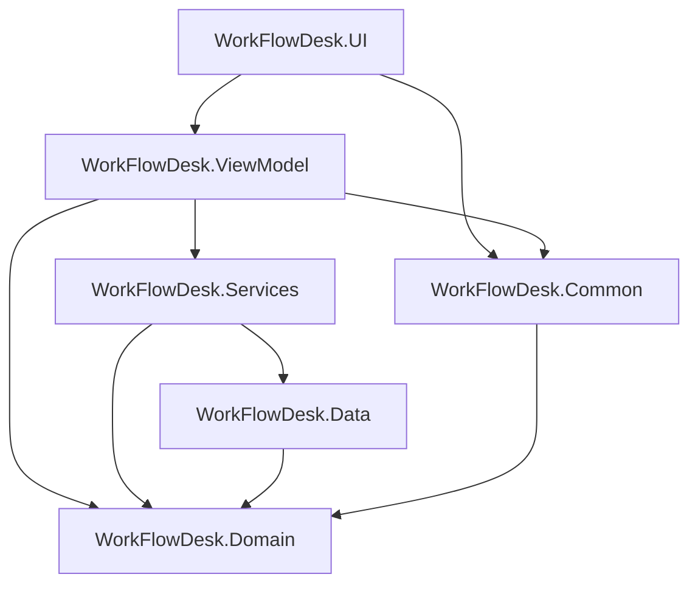

# Arquitectura de WorkFlowDesk

WorkFlowDesk es una aplicación de escritorio WPF organizada en capas. Cada proyecto tiene una responsabilidad clara y las dependencias fluyen hacia el dominio.

## Capas

| Proyecto | Responsabilidad |
|----------|-----------------|
| **UI** | Vistas XAML, controles reutilizables, navegación, diálogos y notificaciones |
| **ViewModel** | Estado de pantalla, comandos MVVM, validación ligera y orquestación |
| **Services** | Reglas de negocio, exportación, backup, autenticación y reportes |
| **Data** | EF Core, repositorios, migraciones y seed de datos demo |
| **Domain** | Entidades, enums y relaciones del modelo |
| **Common** | Sesión, permisos por rol, configuración en disco y helpers compartidos |

## Flujo de arranque

1. `App.xaml.cs` registra servicios en `ServiceLocator` y aplica migraciones EF Core.
2. Se muestra `LoginView`; tras autenticar, `SessionService` guarda el usuario.
3. `MainWindow` usa `NavigationViewFactory` para crear vistas con su ViewModel.
4. `RolePermissions` filtra menú y acciones según el rol de la sesión.

## Patrones utilizados

- **MVVM** con CommunityToolkit.Mvvm (`ObservableObject`, `RelayCommand`).
- **Inyección de dependencias** con `Microsoft.Extensions.DependencyInjection` y `ServiceLocator.Provider`.
- **Repository + Service** en la capa de datos y negocio.
- **Eventos de confirmación** (`ConfirmacionSolicitada`) para desacoplar ViewModels de MessageBox.

## Persistencia

- **SQLite** embebido en `%LocalAppData%/WorkFlowDesk/workflowdesk.db`.
- Migraciones en `WorkFlowDesk.Data/Migrations`.
- Seed de usuarios demo en `DatabaseSeeder`.
- Backup/restore copiando el archivo `.db`.

## Tests

`WorkFlowDesk.Tests` cubre helpers, seguridad (hash de contraseñas), permisos y exportación. La CI en GitHub Actions compila y ejecuta `dotnet test` en cada push a `main`.

## Extensiones futuras

- Inyección de dependencias con `Microsoft.Extensions.DependencyInjection`.
- Más tests de integración sobre servicios con BD en memoria.
- Rediseño visual (Stitch) sin cambiar la arquitectura de capas.
