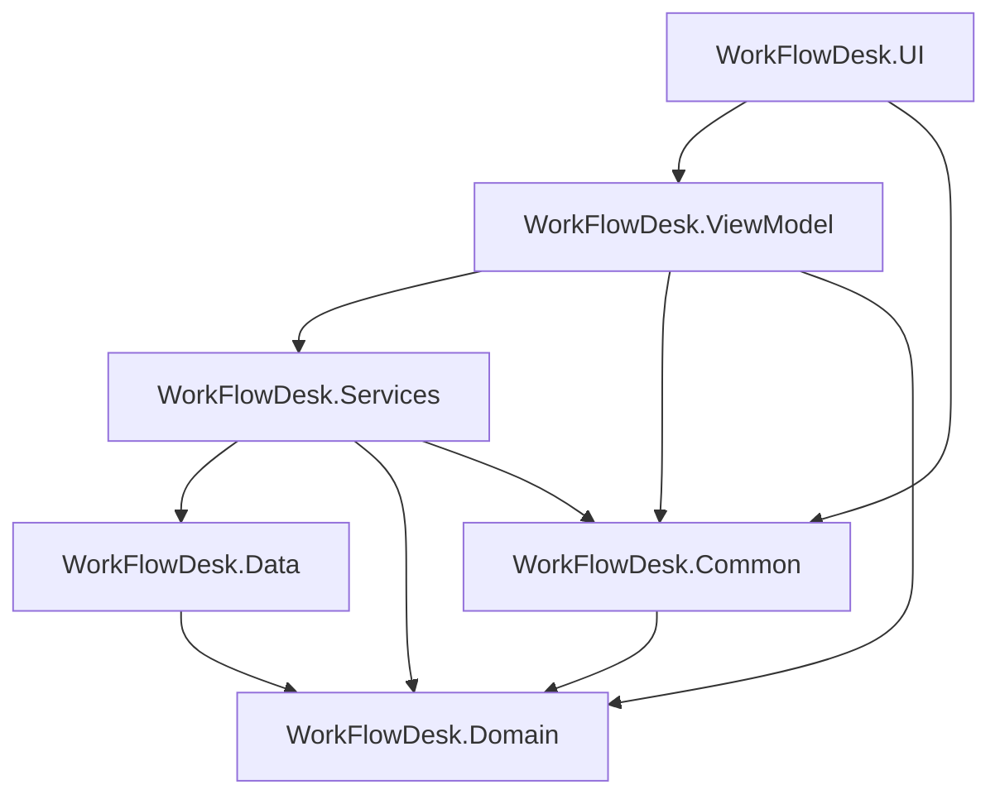

# Arquitectura de WorkFlowDesk

WorkFlowDesk es una aplicación de escritorio WPF (.NET 8) organizada en capas. Cada proyecto tiene una responsabilidad clara y las dependencias fluyen hacia el dominio. La UI sigue el design system **Stitch** (temas claro/oscuro).

## Capas

| Proyecto | Responsabilidad |
|----------|-----------------|
| **UI** | Vistas XAML, controles reutilizables, splash, auth, navegación, búsqueda global (Ctrl+K), diálogos y notificaciones |
| **ViewModel** | Estado de pantalla, comandos MVVM, validación ligera y orquestación por sección |
| **Services** | Reglas de negocio, exportación, backup, auth, reportes, sync, adjuntos, automatizaciones y búsqueda |
| **Data** | EF Core, `ApplicationDbContext`, migraciones y seed de datos demo |
| **Domain** | Entidades, enums y relaciones del modelo |
| **Common** | Sesión, permisos por rol, preferencias de usuario, rutas de datos y helpers compartidos |

## Flujo de arranque

1. **`App.xaml.cs`** carga `appconfig.json`, marca tiempo de arranque, prepara `%LocalAppData%\WorkFlowDesk\` y registra servicios en **`ServiceLocator`** (DI con scope único por sesión).
2. **`DatabaseInitializationService`** aplica migraciones EF Core y ejecuta el seed si hace falta.
3. **`AuthFlowService.StartApplicationAsync`**:
   - Si **`SessionPersistenceService`** tiene una sesión válida (usuario activo, menos de **2 días** sin abrir la app), restaura sesión y preferencias (tema, idioma, notificaciones).
   - Si no, muestra **`AuthWindow`** (login / registro).
4. Tras autenticación correcta: splash post-login (**`SplashScreenService`**) y apertura de **`MainWindow`**.
5. Al cerrar la app, se actualiza `session.json` con la última actividad del usuario.

## Navegación y permisos

- **`MainWindow`** delega en **`MainViewModel`** la barra lateral, atajos (Ctrl+1…9, Ctrl+K, Ctrl+L) y el overlay **`GlobalSearchOverlay`**.
- **`NavigationViewFactory`** instancia cada vista con su ViewModel e inyecta los servicios necesarios.
- **`RolePermissions`** (Common) filtra entradas de menú y capacidad de escritura según rol.

| Vista | ViewModel principal |
|-------|---------------------|
| Dashboard | `DashboardViewModel` |
| Empleados | `EmpleadosViewModel` |
| Proyectos | `ProyectosViewModel` (+ panel detalle y enlace a tareas) |
| Tareas | `TareasViewModel` (lista / Kanban / calendario) |
| Clientes | `ClientesViewModel` |
| Reportes | `ReportesViewModel` |
| Optimización | `OptimizacionViewModel` (flujos y automatizaciones) |
| Configuración | `ConfiguracionViewModel` (backup, sync, webhook) |
| Perfil | `ProfileViewModel` (avatar, 2FA PIN, tema) |

## Patrones utilizados

- **MVVM** con CommunityToolkit.Mvvm (`ObservableObject`, `RelayCommand`, `[NotifyPropertyChangedFor]`).
- **Inyección de dependencias** con `Microsoft.Extensions.DependencyInjection`; resolución vía `ServiceLocator.Provider` y factory de vistas.
- **Repository + Service**: servicios de negocio sobre `ApplicationDbContext` (scoped).
- **Eventos de confirmación** (`ConfirmacionSolicitada`) para desacoplar ViewModels de `MessageBox`.
- **Servicios estáticos de UI** (`AuthFlowService`, `SessionPersistenceService`, `FlujoWorkflowService`) para flujos transversales y persistencia en JSON fuera de EF.

## Servicios registrados (DI)

| Interfaz | Implementación | Uso principal |
|----------|----------------|---------------|
| `IAuthenticationService` | `AuthenticationService` | Login, registro, cambio de contraseña |
| `IPasswordHasherService` | `PasswordHasherService` | PBKDF2 (+ migración desde SHA256 legacy) |
| `IUsuarioService` | `UsuarioService` | CRUD usuarios, PIN secundario |
| `IEmpleadoService` | `EmpleadoService` | Empleados y avatares |
| `IProyectoService` | `ProyectoService` | Proyectos y progreso |
| `ITareaService` | `TareaService` | Tareas, comentarios, estados |
| `ITareaExtensionService` | `TareaExtensionService` | Subtareas, dependencias, time tracking |
| `IClienteService` | `ClienteService` | Clientes |
| `IReporteService` | `ReporteService` | Agregados y gráficos |
| `IExportService` | `ExportService` | CSV en `Exports/` |
| `IBackupService` | `BackupService` | Copia/restauración del `.db` |
| `IActivityLogService` | `ActivityLogService` | Historial auditable por entidad |
| `IGlobalSearchService` | `GlobalSearchService` | Búsqueda unificada Ctrl+K |
| `IAttachmentService` | `AttachmentService` | Archivos adjuntos en disco |
| `ISyncService` | `SyncService` | Paquetes JSON en carpeta compartida |
| `IIntegrationService` | `IntegrationService` | `mailto:` y webhook Slack |
| `IAutomationEngine` | `AutomationEngineService` | Reglas activas tras cambios de tarea/proyecto |
| `IDatabaseInitializationService` | `DatabaseInitializationService` | Migraciones y seed |

## Modelo de dominio

Entidades principales en **`WorkFlowDesk.Domain`**:

- **Usuario**, **Rol** — autenticación y permisos.
- **Empleado** — datos de persona; opcionalmente vinculado a usuario.
- **Cliente**, **Proyecto**, **Tarea** — núcleo operativo (cliente → proyecto → tarea).
- **SubTarea**, **TareaDependencia**, **RegistroTiempo**, **TareaAdjunto** — extensión de tareas (migración `ExtendedFeatures`).
- **RegistroActividad** — auditoría de cambios (quién, qué, cuándo).

Estados y enums (`EstadoTarea`, `EstadoProyecto`, `TipoRol`, etc.) viven junto a las entidades.

## Persistencia

### SQLite (EF Core)

- Archivo: `%LocalAppData%\WorkFlowDesk\workflowdesk.db`
- Migraciones en `WorkFlowDesk.Data/Migrations`:
  - `InitialCreate` — esquema base
  - `AddEmpleadoAvatarIndex`
  - `ExtendedFeatures` — subtareas, dependencias, adjuntos metadata, time tracking, activity log
- Seed demo en **`DatabaseSeeder`** (usuarios admin/supervisor/empleado).
- Listados con **`AsNoTracking`** donde aplica; backup = copia del archivo `.db`.

### JSON y archivos locales (fuera de EF)

| Archivo / carpeta | Contenido |
|-------------------|-----------|
| `session.json` | Sesión restaurable (userId + última actividad UTC) |
| `appconfig.json` | Ruta BD, carpeta sync, preferencias de app |
| `integrations.json` | URL webhook Slack |
| Perfil por usuario | Tema, idioma, PIN hash, notificaciones |
| `workflow.json` | Flujos y automatizaciones de Optimización |
| `attachments/` | Binarios referenciados desde `TareaAdjunto` |
| `Backups/` | Copias `.db` manuales o programadas |

## Automatizaciones

Las reglas se definen en **Optimización** y se persisten en `workflow.json` vía **`FlujoWorkflowService`**.

**`AutomationEngineService`** las evalúa en la propia aplicación:

- Tras cambios de **tarea** (estado, vencimiento, etc.).
- Tras cambios de **proyecto** (p. ej. cierre → notificación in-app + email simulado + log).
- En comprobaciones programadas (retrasos, recordatorios).

Acciones típicas: notificaciones in-app, **`IntegrationService`** (email `mailto:` / Slack), entrada en **`ActivityLogService`**. No hay motor externo ni IA en la nube.

## Sincronización multi-equipo

**`SyncService`** exporta/importa un paquete JSON (clientes, proyectos, tareas, metadatos) hacia una **carpeta compartida** configurada en Configuración. Pensado para equipos pequeños sin servidor central: merge manual por importación, no sync en tiempo real.

## Seguridad

- Contraseñas: **PBKDF2**; migración automática desde hashes SHA256 antiguos.
- **PIN secundario** opcional (2FA local) almacenado hasheado en preferencias de perfil.
- Confirmación antes de operaciones destructivas (eliminar entidades, inicializar BD).
- Empleado: acceso a Tareas en **solo lectura** (`RolePermissions.IsReadOnlyUser`).

## Tests

**`WorkFlowDesk.Tests`** (xUnit, EF Core InMemory donde hace falta): **52** casos que cubren, entre otros:

- Helpers (paginación, búsqueda, validación)
- Seguridad (hash de contraseñas)
- Permisos por rol
- Servicios: auth, empleados, clientes, proyectos, tareas, reportes, backup, búsqueda global, extensiones de tarea, flujo workflow, persistencia de sesión
- Exportación CSV

CI: `.github/workflows/build.yml` — `dotnet build` + `dotnet test` en cada push a `main`.

## Extensiones futuras (reales)

- Tests de integración adicionales sobre servicios con SQLite en memoria o archivo temporal.
- Empaquetado MSIX / instalador sin cambiar la arquitectura de capas.
- Ampliar sync (resolución de conflictos) si el uso multi-equipo lo exige.
